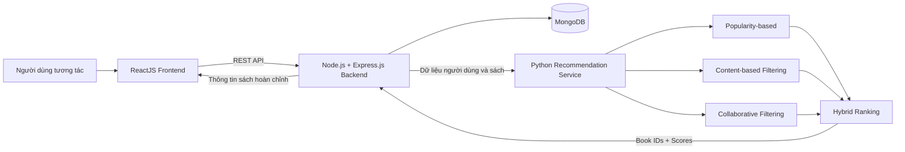

# 📚 BookBee - Hệ thống bán sách kết hợp gợi ý sản phẩm cá nhân hóa

<p align="center">
  <strong>Personalized Book E-commerce & Recommendation System</strong>
</p>

<p align="center">
  
  
  
  
  
  
  
</p>

> [!NOTE]
> Phần hướng dẫn cài đặt sử dụng các giá trị đặt trong dấu `<...>` vì báo cáo không cung cấp đường dẫn repository, tên thư mục, tên script và biến môi trường thực tế. Hãy thay các giá trị này theo mã nguồn của dự án trước khi công khai README.

## 👨‍🎓 Thông tin đồ án

| Thông tin                | Nội dung                                                                            |
| ------------------------ | ----------------------------------------------------------------------------------- |
| **Tên đề tài**           | Xây dựng hệ thống bán sách kết hợp gợi ý sản phẩm theo hướng cá nhân hóa người dùng |
| **Sinh viên thực hiện**  | Kiều Gia Thịnh                                                                      |
| **Mã số sinh viên**      | 110122167                                                                           |
| **Lớp**                  | DA22TTC                                                                             |
| **Khóa**                 | 2022                                                                                |
| **Giảng viên hướng dẫn** | ThS. Phạm Minh Đương                                                                |
| **Đơn vị**               | Trường Kỹ thuật và Công nghệ - Đại học Trà Vinh                                     |
| **Thời gian hoàn thành** | Tháng 6 năm 2026                                                                    |
| **Email**                | kieugiathinh13012004@gmail.com                                                      |

---

## 📖 Giới thiệu

**BookBee** là hệ thống thương mại điện tử bán sách trực tuyến được xây dựng trên nền tảng **MERN Stack**, cung cấp đầy đủ quy trình từ tìm kiếm sản phẩm, quản lý giỏ hàng, đặt hàng, thanh toán, theo dõi đơn hàng đến đánh giá sách.

Điểm nổi bật của dự án là hệ thống gợi ý sách theo hướng cá nhân hóa. Hệ thống thu thập và phân tích nhiều loại dữ liệu tương tác của người dùng như lượt xem, từ khóa tìm kiếm, hành vi thêm vào giỏ hàng, lịch sử mua hàng và đánh giá sản phẩm. Từ đó, module gợi ý được xây dựng bằng Python tạo ra danh sách sách phù hợp với nhu cầu và sở thích của từng người dùng.

Bên cạnh đó, hệ thống tích hợp **Gemini API** để xây dựng trợ lý ảo hỗ trợ tra cứu thông tin, tư vấn và khám phá sách bằng ngôn ngữ tự nhiên.

---

## ✨ Điểm nổi bật

- Website bán sách trực tuyến với đầy đủ nghiệp vụ thương mại điện tử.
- Gợi ý sách theo độ phổ biến dành cho người dùng mới hoặc chưa có đủ dữ liệu.
- Gợi ý dựa trên nội dung sách bằng **Content-based Filtering**.
- Gợi ý dựa trên hành vi cộng đồng bằng **Collaborative Filtering**.
- Kết hợp hai phương pháp bằng **Hybrid Recommendation** để tăng mức độ phù hợp.
- Thu thập dữ liệu từ lượt xem, tìm kiếm, giỏ hàng, mua hàng và đánh giá.
- Module gợi ý Python hoạt động như một dịch vụ độc lập và giao tiếp với Backend qua REST API.
- Trợ lý ảo Gemini AI hỗ trợ tìm kiếm và tư vấn sách bằng ngôn ngữ tự nhiên.
- Hỗ trợ thanh toán khi nhận hàng, Stripe và VNPay.
- Hỗ trợ Coupon, Flash Sale, Slider và Banner quảng bá.
- Dashboard quản trị theo dõi doanh thu, đơn hàng, sách bán chạy và tồn kho.
- Giao diện responsive, hỗ trợ nhiều kích thước thiết bị.

---

## 🎯 Mục tiêu dự án

- Xây dựng website bán sách trực tuyến có giao diện trực quan và quy trình mua hàng thuận tiện.
- Đáp ứng các nghiệp vụ quản lý người dùng, sách, danh mục, giỏ hàng, đơn hàng, thanh toán và đánh giá.
- Thu thập dữ liệu tương tác để phân tích hành vi và sở thích của người dùng.
- Xây dựng hệ thống gợi ý sách cá nhân hóa bằng nhiều phương pháp khác nhau.
- Tích hợp trợ lý ảo AI để hỗ trợ tìm kiếm, tư vấn và giải đáp thông tin về sách.
- Cung cấp khu vực quản trị tập trung và các số liệu hỗ trợ theo dõi hoạt động kinh doanh.

---

## 🧩 Chức năng hệ thống

### 👤 Khách hàng

- Đăng ký tài khoản bằng họ tên, email và mật khẩu.
- Đăng nhập bằng tài khoản hệ thống hoặc tài khoản Google OAuth.
- Xác thực và duy trì phiên đăng nhập bằng JWT kết hợp Cookie.
- Tìm kiếm sách theo tên, tác giả hoặc nhà xuất bản.
- Lọc theo danh mục, thể loại và khoảng giá.
- Sắp xếp theo thời gian cập nhật, giá, số lượng bán hoặc mức đánh giá.
- Xem chi tiết sách, bình luận, điểm đánh giá và các sản phẩm liên quan.
- Thêm, cập nhật số lượng hoặc xóa sách khỏi giỏ hàng.
- Áp dụng mã giảm giá còn hiệu lực.
- Đặt hàng và lựa chọn phương thức thanh toán COD, Stripe hoặc VNPay.
- Xem lịch sử, chi tiết và trạng thái xử lý đơn hàng.
- Yêu cầu hủy đơn khi đơn hàng chưa được xác nhận hoặc chưa giao.
- Đánh giá sách đã mua với số điểm từ 1 đến 5 sao.
- Nhận gợi ý sách theo độ phổ biến và gợi ý cá nhân hóa.
- Trao đổi với trợ lý ảo AI để tìm kiếm hoặc nhận tư vấn sách.
- Quản lý thông tin cá nhân, mật khẩu và địa chỉ nhận hàng.

### 🛡️ Quản trị viên

- Quản lý danh mục sách.
- Quản lý sách, hình ảnh, giá bán, giá khuyến mãi và tồn kho.
- Quản lý đơn hàng theo các giai đoạn xử lý.
- Theo dõi phương thức và trạng thái thanh toán.
- Quản lý người dùng, khóa hoặc mở khóa tài khoản.
- Quản lý đánh giá và ẩn hoặc xóa nội dung không phù hợp.
- Quản lý mã giảm giá Coupon.
- Quản lý chương trình Flash Sale.
- Quản lý Slider và Banner trên trang chủ.
- Xem Dashboard thống kê doanh thu, đơn hàng, người dùng, sách bán chạy và cảnh báo tồn kho.

---

## 🧠 Hệ thống gợi ý sách cá nhân hóa

Hệ thống triển khai bốn phương pháp gợi ý nhằm đáp ứng nhiều trường hợp sử dụng khác nhau.

| Phương pháp                 | Mô tả                                                                                                               |
| --------------------------- | ------------------------------------------------------------------------------------------------------------------- |
| **Popularity-based**        | Đề xuất sách bán chạy, được xem nhiều hoặc có đánh giá cao; phù hợp với người dùng mới.                             |
| **Content-based Filtering** | Đề xuất các sách có đặc trưng tương đồng về danh mục, thể loại, tác giả, nhà xuất bản, tags và mô tả.               |
| **Collaborative Filtering** | Phân tích hành vi của cộng đồng để tìm người dùng hoặc sản phẩm có mức độ tương đồng.                               |
| **Hybrid Recommendation**   | Kết hợp kết quả Content-based và Collaborative Filtering nhằm tăng độ phù hợp và giảm hạn chế của từng phương pháp. |

### Dữ liệu tương tác được khai thác

- Xem chi tiết sách.
- Tìm kiếm sách.
- Thêm sách vào giỏ hàng.
- Mua sách.
- Đánh giá và bình luận.
- Thời lượng hoặc mức độ tương tác khi dữ liệu được ghi nhận.

### Luồng xử lý gợi ý



Khi nhận kết quả từ dịch vụ Python, Backend truy xuất dữ liệu sách trong MongoDB, loại bỏ những sản phẩm đã ẩn, ngừng kinh doanh hoặc không còn phù hợp rồi trả kết quả về Frontend dưới dạng JSON.

---

## 🤖 Trợ lý ảo Gemini AI

Trợ lý ảo được tích hợp qua **Gemini API**, cho phép người dùng trao đổi bằng ngôn ngữ tự nhiên để:

- Tìm kiếm sách theo tên, tác giả, thể loại hoặc nhà xuất bản.
- Tìm sách theo mức giá mong muốn.
- Nhận tư vấn sách theo mục đích học tập, giải trí hoặc phát triển bản thân.
- Tra cứu mô tả và thông tin cơ bản của sách.
- Khám phá sách theo chủ đề hoặc sở thích được cung cấp trong phiên trò chuyện.

> Trợ lý ảo là chức năng hỗ trợ bổ sung. Hệ thống gợi ý cá nhân hóa bằng Python vẫn là nội dung nghiên cứu trọng tâm của dự án.

---

## 🛠️ Công nghệ sử dụng

### Frontend

- **ReactJS** - xây dựng giao diện người dùng dạng SPA.
- **Tailwind CSS** - thiết kế và tùy biến giao diện responsive.
- **RESTful API** - giao tiếp với Backend.

### Backend

- **Node.js** - môi trường thực thi JavaScript phía máy chủ.
- **Express.js** - xây dựng API và xử lý nghiệp vụ.
- **Mongoose** - ánh xạ và truy vấn dữ liệu MongoDB.
- **JWT + Cookie** - xác thực và duy trì phiên đăng nhập.
- **Google OAuth** - đăng nhập bằng tài khoản Google.

### Cơ sở dữ liệu

- **MongoDB** - lưu trữ người dùng, sách, đơn hàng, đánh giá, khuyến mãi, hội thoại và lịch sử tương tác.

### Recommendation & AI

- **Python** - xây dựng dịch vụ gợi ý sách.
- **Content-based Filtering**.
- **Collaborative Filtering**.
- **Hybrid Recommendation**.
- **Gemini API** - xây dựng trợ lý ảo AI.

### Thanh toán

- **COD** - thanh toán khi nhận hàng.
- **Stripe** - thanh toán trực tuyến.
- **VNPay** - thanh toán trực tuyến.

---

## ⚙️ Kiến trúc hệ thống

Hệ thống được xây dựng theo mô hình **Client-Server** kết hợp kiến trúc phân lớp. Frontend gửi yêu cầu HTTP đến Backend qua RESTful API. Backend thực hiện xác thực, phân quyền, xử lý nghiệp vụ, truy xuất MongoDB và giao tiếp với dịch vụ gợi ý Python.

<p align="center">
  
</p>

### Quy trình xử lý chính

1. Người dùng thao tác trên giao diện ReactJS.
2. Frontend gửi yêu cầu HTTP đến Backend.
3. Middleware kiểm tra JWT, tài khoản và quyền truy cập.
4. Controller tiếp nhận, kiểm tra dữ liệu đầu vào và gọi tầng Service.
5. Service xử lý nghiệp vụ và sử dụng Mongoose Model để truy vấn MongoDB.
6. Với yêu cầu gợi ý, Backend gửi dữ liệu đến dịch vụ Python.
7. Python phân tích dữ liệu và trả danh sách mã sách cùng điểm phù hợp.
8. Backend hoàn thiện dữ liệu và gửi JSON Response về Frontend.

---

## 🗃️ Mô hình dữ liệu

<p align="center">
  
</p>

### Các collection chính

| Collection          | Mục đích                                                                            |
| ------------------- | ----------------------------------------------------------------------------------- |
| **User**            | Lưu tài khoản, thông tin cá nhân, vai trò và trạng thái người dùng.                 |
| **Category**        | Lưu danh mục và thông tin phân loại sách.                                           |
| **Product**         | Lưu thông tin sách, tác giả, nhà xuất bản, giá, tồn kho và đặc trưng phục vụ gợi ý. |
| **Order**           | Lưu thông tin chung, phương thức thanh toán, phí vận chuyển và trạng thái đơn hàng. |
| **OrderDetail**     | Lưu các sách, số lượng và giá trong từng đơn hàng.                                  |
| **Review**          | Lưu điểm đánh giá và bình luận của khách hàng.                                      |
| **Coupon**          | Lưu mã giảm giá, điều kiện áp dụng và giới hạn sử dụng.                             |
| **FlashSale**       | Lưu thông tin và thời gian diễn ra chương trình Flash Sale.                         |
| **FlashSaleItems**  | Lưu danh sách sách tham gia Flash Sale và giá ưu đãi.                               |
| **ChatSession**     | Lưu phiên hội thoại giữa người dùng và trợ lý ảo.                                   |
| **UserInteraction** | Lưu dữ liệu hành vi phục vụ phân tích và cá nhân hóa gợi ý.                         |

---

## 📂 Cấu trúc dự án dự kiến

> Cập nhật tên thư mục dưới đây theo cấu trúc repository thực tế.

```text
<project-root>/
├── <frontend-directory>/          # ReactJS + Tailwind CSS
├── <backend-directory>/           # Node.js + Express.js + Mongoose
├── <recommendation-directory>/    # Python recommendation service
├── docs/
│   └── images/                    # Ảnh kiến trúc và giao diện
├── .gitignore
└── README.md
```

---

## 🚀 Cài đặt và chạy dự án

### 1. Yêu cầu môi trường

- Git.
- Node.js và npm.
- Python 3 và pip.
- MongoDB cài đặt cục bộ hoặc tài khoản MongoDB Atlas.
- Gemini API Key.
- Google OAuth credentials.
- Stripe credentials nếu sử dụng thanh toán Stripe.
- Thông tin cấu hình VNPay nếu sử dụng thanh toán VNPay.

### 2. Clone repository

```bash
git clone <REPOSITORY_URL>
cd <PROJECT_DIRECTORY>
```

### 3. Cài đặt Backend

```bash
cd <BACKEND_DIRECTORY>
npm install

# Tạo file môi trường theo mẫu của dự án
cp .env.example .env

npm run dev
```

### 4. Cài đặt Frontend

Mở terminal mới:

```bash
cd <FRONTEND_DIRECTORY>
npm install

# Tạo file môi trường theo mẫu của dự án
cp .env.example .env

npm run dev
```

### 5. Cài đặt dịch vụ gợi ý Python

Mở terminal mới:

```bash
cd <RECOMMENDATION_DIRECTORY>

python -m venv .venv

# Windows
.venv\Scripts\activate

# macOS/Linux
source .venv/bin/activate

pip install -r requirements.txt
python <PYTHON_ENTRY_FILE>.py
```

### 6. Cấu hình cần thiết

Tên biến môi trường phải được lấy từ file `.env.example` hoặc mã nguồn thực tế. Các nhóm cấu hình tối thiểu gồm:

| Nhóm cấu hình              | Nội dung                                              |
| -------------------------- | ----------------------------------------------------- |
| **Database**               | Chuỗi kết nối MongoDB.                                |
| **Authentication**         | JWT secret, Cookie options và thời gian hết hạn.      |
| **Google OAuth**           | Client ID, Client Secret và Callback URL.             |
| **Frontend/Backend**       | URL Frontend, URL Backend và CORS origin.             |
| **Recommendation Service** | URL hoặc cổng của dịch vụ Python.                     |
| **Gemini AI**              | Gemini API Key và tên model được sử dụng.             |
| **Stripe**                 | Secret Key, Publishable Key và Webhook Secret nếu có. |
| **VNPay**                  | Terminal Code, Secret Key, Return URL và API URL.     |

---

## 🧭 Hướng dẫn sử dụng

### Khách hàng

1. Đăng ký tài khoản hoặc đăng nhập bằng Google.
2. Tìm kiếm, lọc hoặc xem danh sách sách trên trang chủ.
3. Xem chi tiết sách và thêm sản phẩm vào giỏ hàng.
4. Chọn địa chỉ nhận hàng, phương thức vận chuyển và thanh toán.
5. Theo dõi trạng thái trong trang lịch sử đơn hàng.
6. Đánh giá sách sau khi đơn hàng được giao thành công.
7. Truy cập khu vực gợi ý để khám phá sách phù hợp với sở thích.
8. Sử dụng trợ lý ảo để tìm kiếm hoặc nhận tư vấn sách.

### Quản trị viên

1. Đăng nhập bằng tài khoản có vai trò Admin.
2. Truy cập Dashboard để theo dõi số liệu tổng quan.
3. Quản lý danh mục, sách, tồn kho, người dùng và đơn hàng.
4. Quản lý đánh giá, Coupon, Flash Sale, Slider và Banner.
5. Theo dõi doanh thu, sản phẩm bán chạy và cảnh báo tồn kho.

---

## ✅ Kết quả đạt được

- Hoàn thiện các chức năng chính của website thương mại điện tử bán sách.
- Xây dựng giao diện khách hàng và khu vực quản trị riêng biệt.
- Hỗ trợ đăng nhập truyền thống và Google OAuth.
- Hỗ trợ giỏ hàng, đặt hàng, thanh toán, lịch sử đơn và đánh giá sản phẩm.
- Xây dựng module gợi ý sách bằng Python.
- Kết hợp Content-based Filtering và Collaborative Filtering trong mô hình lai.
- Ghi nhận dữ liệu hành vi từ nhiều nguồn để phục vụ cá nhân hóa.
- Tích hợp trợ lý ảo Gemini AI.
- Hỗ trợ Coupon, Flash Sale và các thống kê quản trị cơ bản.

---

## ⚠️ Hạn chế

- Dữ liệu tương tác hiện có quy mô nhỏ và chủ yếu được thu thập trong quá trình thử nghiệm.
- Độ chính xác của gợi ý cho người dùng mới hoặc người dùng ít tương tác chưa đạt mức tối ưu.
- Chưa có đánh giá chuyên sâu trong điều kiện số lượng lớn người dùng truy cập đồng thời.
- Chưa tích hợp đầy đủ các cổng thanh toán nội địa phổ biến.
- Chưa kết nối hoàn chỉnh với các đơn vị vận chuyển và theo dõi giao hàng theo thời gian thực.
- Hiệu quả thuật toán cần được đánh giá thêm bằng các chỉ số định lượng trên tập dữ liệu lớn hơn.

---

## 🔭 Hướng phát triển

- Mở rộng tập dữ liệu hành vi và thời gian tương tác của người dùng.
- Nghiên cứu các mô hình Machine Learning và Recommendation nâng cao.
- Xây dựng khảo sát sở thích ban đầu cho người dùng mới.
- Bổ sung các phương pháp đánh giá như Precision, Recall, F1-score, MAP hoặc NDCG.
- Phát triển ứng dụng trên thiết bị di động.
- Tích hợp thêm MoMo, ZaloPay và các cổng thanh toán nội địa khác.
- Kết nối dịch vụ vận chuyển và cập nhật trạng thái giao hàng theo thời gian thực.
- Tối ưu hiệu năng, bộ nhớ đệm và khả năng mở rộng khi lượng dữ liệu tăng.

---

## 📚 Tài liệu tham khảo chính

- [MongoDB Documentation](https://www.mongodb.com/docs/)
- [Express.js Documentation](https://expressjs.com/)
- [React Documentation](https://react.dev/)
- [Node.js Documentation](https://nodejs.org/docs/latest/api/)
- [Python Documentation](https://docs.python.org/3/)
- [Gemini API Documentation](https://ai.google.dev/gemini-api/docs)
- [Stripe Documentation](https://docs.stripe.com/)

---

## 📬 Liên hệ

- **Sinh viên thực hiện:** Kiều Gia Thịnh
- **Email:** kieugiathinh13012004@gmail.com

---

## 📌 License

© 2026 Kiều Gia Thịnh. Dự án được xây dựng phục vụ mục đích học tập, nghiên cứu và thực hiện đồ án tốt nghiệp.
